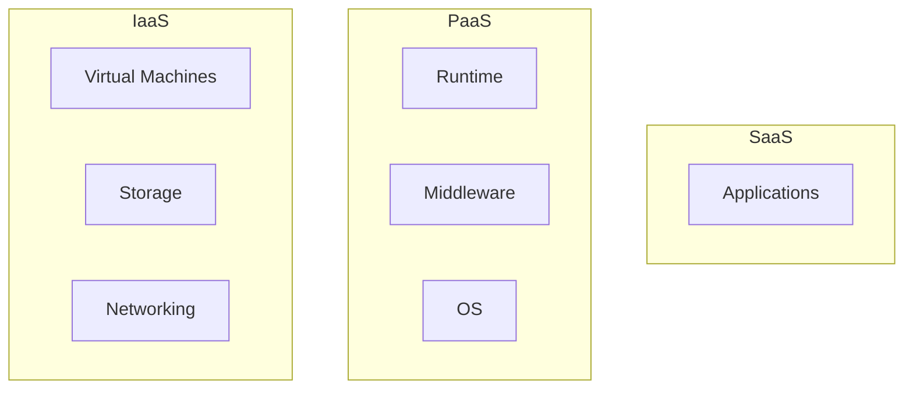
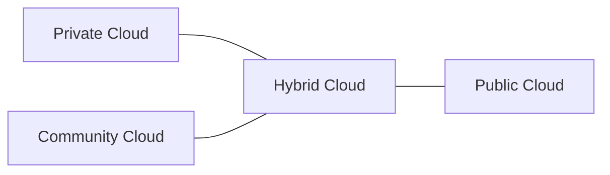
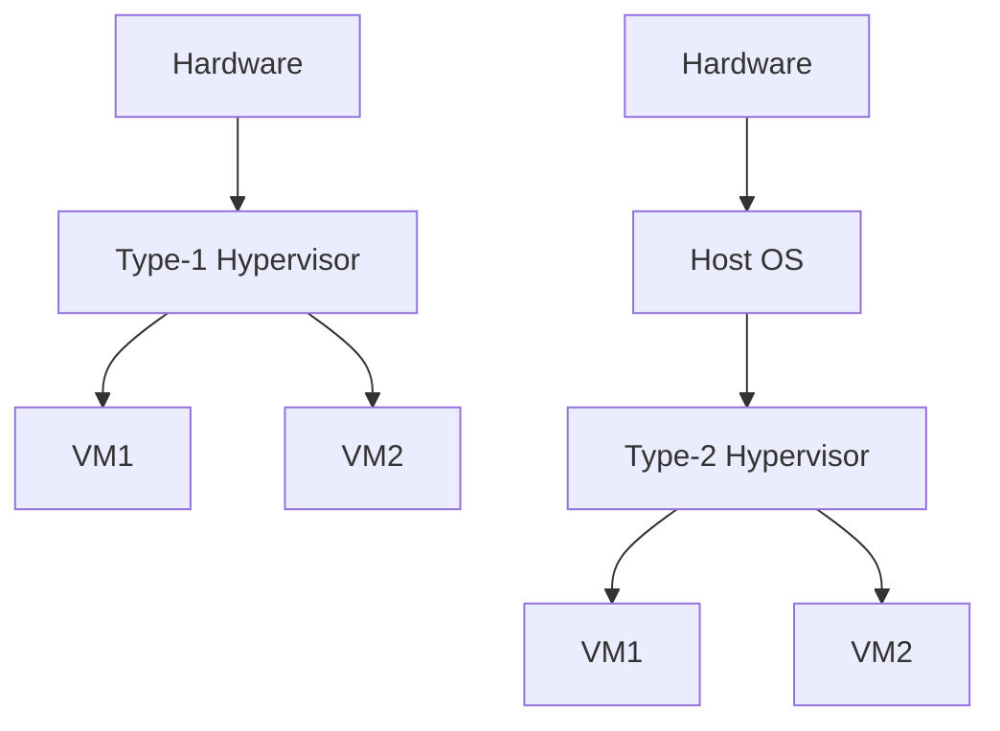
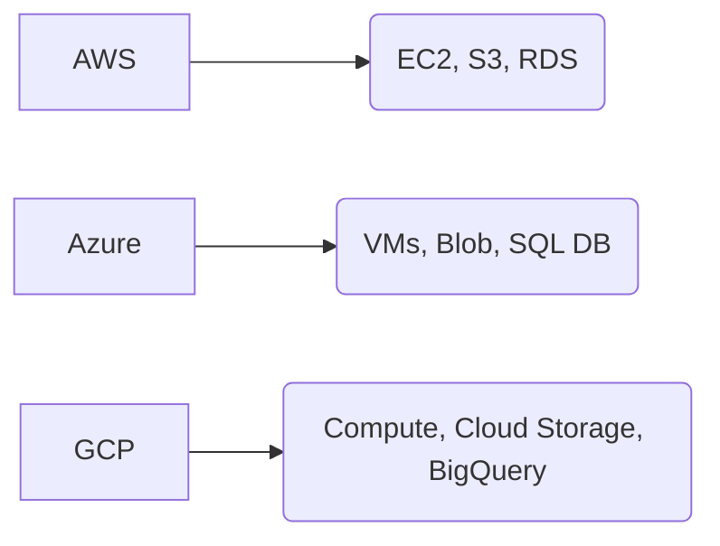
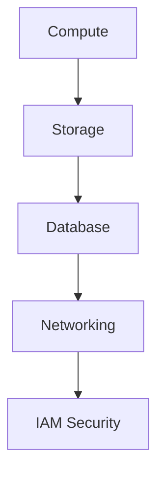
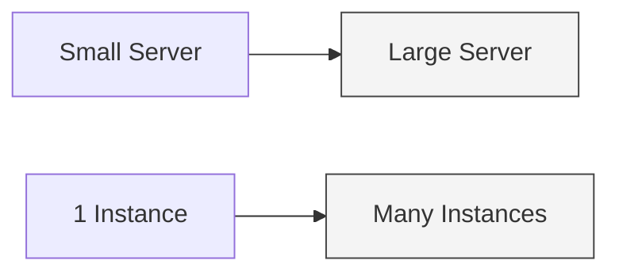

© 2025 Geethanjali Group of Institutions. All Rights Reserved. Unauthorized use or distribution is prohibited.

# Cloud Computing Preparation Guide  

## Introduction to Cloud Computing

Cloud computing is the **on-demand delivery of computing services** like servers, storage, databases, networking, analytics, and more over the internet with *pay-as-you-go pricing*.

### Key Characteristics (NIST)
| Feature | Meaning |
|---------|---------|
| On-Demand Self Service | Provision resources without human interaction |
| Broad Network Access | Access via laptop, phone, tablets etc |
| Resource Pooling | Multi-tenant model, shared resources |
| Rapid Elasticity | Auto scale up/down |
| Measured Service | Metered billing |

### Why Cloud?
- Zero upfront infra cost (CapEx → OpEx)
- High availability + global reach
- Auto-scaling, fault tolerance
- Faster deployment than on-prem

#### Visual: NIST Cloud Characteristics

```mermaid
graph TD
    A[Cloud Computing] --> B(On-Demand)
    A --> C(Broad Network Access)
    A --> D(Resource Pooling)
    A --> E(Rapid Elasticity)
    A --> F(Measured Service)
````

---

## Cloud Service Models (SPI Model)

| Model | User Manages                 | Vendor Manages                | Example Services                     |
| ----- | ---------------------------- | ----------------------------- | ------------------------------------ |
| IaaS  | OS, Apps, Runtime            | Hardware, Storage, Networking | AWS EC2, Azure VMs                   |
| PaaS  | Applications                 | OS, Runtime, Hardware         | Google App Engine, Azure App Service |
| SaaS  | Nothing (only uses software) | Everything                    | Gmail, Salesforce                    |

#### Quick Memory Trick

```
IaaS → Rent hardware  
PaaS → Rent platform  
SaaS → Rent software  
```

#### Diagram: Service Model Layers



---

## Cloud Deployment Models

| Model     | Hosted Where            | Used By                     | Example              |
| --------- | ----------------------- | --------------------------- | -------------------- |
| Public    | Shared over internet    | Startups, Individuals       | AWS, Azure, GCP      |
| Private   | Exclusive to org        | Banks, Govt                 | On-prem OpenStack    |
| Hybrid    | Mix of public+private   | Enterprises                 | Azure Arc + Local DC |
| Community | Shared infra among orgs | Universities, Research labs | CERN Cloud           |

#### Diagram: Deployment Models



---

## Virtualization in Cloud

Virtualization = creating **virtual versions** of servers, storage, networks.

### Types

| Type                   | Description                |
| ---------------------- | -------------------------- |
| Server Virtualization  | Multiple VMs on one server |
| Storage Virtualization | Pooled storage abstraction |
| Network Virtualization | SDN, VLANs                 |
| Desktop Virtualization | VDI / remote desktops      |

### Hypervisor Types

| Type                | Runs On            | Examples                       |
| ------------------- | ------------------ | ------------------------------ |
| Type-1 (Bare Metal) | Direct on hardware | VMware ESXi, Hyper-V           |
| Type-2 (Hosted)     | Runs on OS         | VirtualBox, VMware Workstation |

#### Diagram: Hypervisor Types



---

## Major Cloud Providers & Services

| Provider | Compute        | Storage       | DB                   | AI/ML     |
| -------- | -------------- | ------------- | -------------------- | --------- |
| AWS      | EC2            | S3            | RDS, DynamoDB        | SageMaker |
| Azure    | VMs            | Blob          | Azure SQL, CosmosDB  | Azure ML  |
| GCP      | Compute Engine | Cloud Storage | Cloud SQL, Firestore | Vertex AI |

#### Diagram: Provider Service Comparison



---

## Basic Cloud Services (Core Building Blocks)

### 1. Compute

| Provider | Service          |
| -------- | ---------------- |
| AWS      | EC2              |
| Azure    | Virtual Machines |
| GCP      | Compute Engine   |

### 2. Storage

| Type   | Example            |
| ------ | ------------------ |
| Object | AWS S3, Azure Blob |
| Block  | EBS, Azure Disk    |
| File   | EFS, Azure Files   |

### 3. Database

| Type       | Examples           |
| ---------- | ------------------ |
| Relational | RDS, Azure SQL     |
| NoSQL      | DynamoDB, CosmosDB |

### 4. Networking

* VPC / VNet
* Load Balancers
* CDN (CloudFront, Azure CDN)

### 5. IAM

* Authentication, authorization, policies, MFA

#### Diagram: Cloud Service Layers



---

## Scaling & Elasticity

| Scaling Type       | Meaning                          | Example                |
| ------------------ | -------------------------------- | ---------------------- |
| Vertical Scaling   | Increase machine power (CPU/RAM) | 2 vCPU → 8 vCPU        |
| Horizontal Scaling | Add more instances               | 2 servers → 10 servers |

#### Diagram: Scaling Types



---

## Common Interview Q&A

| Question               | Answer                                               |
| ---------------------- | ---------------------------------------------------- |
| What is elasticity?    | Ability to auto scale resources up/down              |
| What is multi tenancy? | Many customers share same infra securely             |
| IaaS vs PaaS?          | IaaS gives infra, PaaS gives platform to deploy apps |
| Cloud ≠ Always cheap   | Bad architecture = high cost                         |
| VM vs Container?       | VM contains full OS, container shares host kernel    |

---

## Common Mistakes & Gotchas

| Mistake                   | Correction                      |
| ------------------------- | ------------------------------- |
| SaaS gives infrastructure | SaaS gives software only        |
| Public cloud = Free cloud | Public ≠ Free                   |
| VM = Container            | No, containers are lightweight  |
| Cloud always cheaper      | Only if resources are optimized |

---

## Final Revision Sheet

| Topic         | What to Memorize                                  |
| ------------- | ------------------------------------------------- |
| 5 NIST traits | On-Demand, Network, Pooling, Elasticity, Measured |
| SPI Model     | IaaS=PaaS=SaaS responsibility chart               |
| Hypervisors   | Type-1 = bare metal, Type-2 = hosted              |
| Deployment    | Public / Private / Hybrid / Community             |
| Core Services | Compute, Storage, DB, Network, IAM                |
